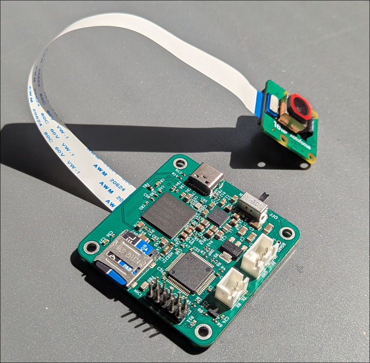
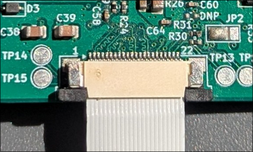
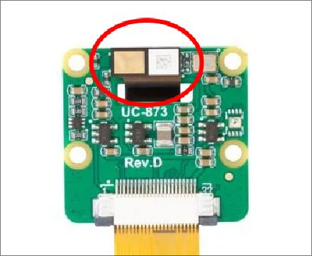

# SRAD Cameras -  Operator's Manual

Please read the following document carefully as there are several important notes that could result in data loss or damage if ignored. After the rocket is recovered, please follow [Post-Flight Operations](#post-flight-operations).

Various tools for interacting with the camera boards have been provided in `./tools`. Each of these scripts can be passed `-h` as a flag to see the correct usage. Usage of these scripts is also detailed throughout this file. These scripts + this manual is largely written with the assumption that the user is on a reasonably mainstream Linux distro with common tools available. 

You will need a USB-C cable to pull files off of the camera (although the SD card should be imaged after flight as a precaution before doing this) and a USB<->UART adapter to send/receive camera commands/status.

Please send me a message if uncertain about anything or if issues arise!

## Table of Contents

- [Pre-Flight Checklist](#pre-flight-checklist)
    - [FPC Cable](#fpc-cable)
    - [Arducam Module](#arducam-module)
    - [SD Card](#sd-card)
    - [Operational Test](#operational-test)
    - [Before Launch](#before-launch)
- [Important Warnings & Info](#important-warnings--info)
- [Board Info](#board-info)
    - [Camera Status](#camera-status)
    - [Correct FPC Orientation](#correct-fpc-orientation)
    - [Arducam Ribbon connector](#arducam-ribbon-connector)
- [SD Card Operations](#sd-card-operations)
    - [SD Card Format](#sd-card-format)
- [Recovering Recordings](#recovering-recordings)
    - [Post-Flight Operations](#post-flight-operations)
    - [Pulling Recordings Directly](#pulling-recordings-directly)
- [Inspecting Recording Logs for Issues](#inspecting-recording-logs-for-issues)
    - [Common Errors & Causes](#common-errors--causes)
    - [`CAM2` Errata](#cam2-errata)

## Pre-Flight Checklist

This checklist is per-camera, e.g. each item should be checked on each camera module.

##### FPC Cable

- [ ] FPC is securely connected to both boards, without unneccesary strain, bends, or creases
- [ ] The FPC cable is oriented correctly (see [Correct FPC Orientation](#correct-fpc-orientation))
- [ ] The FPC cable is routed safely, away from power cables and PCBs (see [Important Warnings & Info](#important-warnings--info))
- [ ] If time permits, 3D print a cover for `CAM1` (Recovery Bay camera) to hold FPC away from board. Leave gap for airflow over SoC

##### Arducam Module

- [ ] The small black ribbon connector on the back of the module is in place (see [Arducam Ribbon connector](#arducam-ribbon-connector))
- [ ] The lens is oriented properly and lines up with its viewport (into Recovery/out of fuselage)

##### SD Card

- [ ] The SD card has been cleared using [./tools/wipe-sd-data](./tools/wipe-sd-data) (see [SD Card Operations](#sd-card-operations)) OR it has been verified over SSH using the `df` utility that the `/data` partition retains a significant portion of its capacity (preferably >50%)

##### Operational Test

- [ ] The camera board responds to `START`/`STOP` commands and correctly enters into and reports `STARTING`/`RECORDING`/`STOPPING`/`STOPPED` states based on commands from the Flight Computer/Ground Station
- [ ] After the above, the recording/logs can be pulled from the card properly using [./tools/pull-recording](./tools/pull-recording) (see [Recovering Recordings](#recovering-recordings))
- [ ] No non-benign error messages are reported in the various recording log files (see [Inspecting Recording Logs for Issues](#inspecting-recording-logs-for-issues))
- [ ] The resulting files can be properly combined using [./tools/mux](./tools/mux) and play without issues

##### Before Launch

- [ ] Power and UART lines are securely connected to the camera board and to Modular Power Supply/Flight Computer
- [ ] **IMPORTANT**: Slide switch on the camera board is in the `ON` position (closest to USB-C port)

## Important Warnings & Info

> [!WARNING]
> The SD cards already in the cameras have been correctly formatted as the SoC expects. You CANNOT clear or zero the entire SD card as this will wipe the OS!

> [!NOTE]
> The SD cards do not have a standard partition table as the SoC does not support this. This means that if you plug the SD card into your computer you will not see individual partitions/sizes/filesystem types, and it is not possible to pull files off the SD card this way. This is to be expected and is not an error. 

> [!WARNING]
> Do NOT plug in the USB-C cable while the main camera board is either powered through `JST1` or connected to the Modular Power Supply! Neither device has reverse-voltage protection for this scenario and the outcome of this is unpredictable and potentially damaging.

> [!WARNING]
> ALWAYS ensure that the camera reports a `STOPPED`/`0x0` state before switching it off or disconnecting it from the power supply. Sending `STOP` allows the camera to safely power down the SoC and unmount the SD card. While significant consideration has been given to preventing data loss during power-cut events, we do not want this to happen any more than necessary! The only time power should potentially be cut directly is during a non-nominal flight.

> [!NOTE]
> It is not possible to send commands that cause the camera to shut off in an unsafe way (unless the camera decides that this is necessary, e.g. in the case of SoC responses timing out). Sending `START` or `STOP` commands in any state will always be handled in a way that allows the SoC to unmount the SD card and shut down safely.

> [!CAUTION]
> Ensure the 1x22 FPC cable between the main camera board and the Arducam module is routed as far as possible from power cables and PCBs. The FPC should NEVER be pressed up against either the main camera PCB or the back of the Arducam PCB as this may cause the data sent through it to be corrupted. If this happens during flight, the recording will continue safely, but some non-zero number of frames will likely be lost.

## Board Info

### Camera Status

The status LED between the two JST connectors will blink 3 times on power-up to indicate that the STM32 has started. After this has completed, the LED has three possible states that indicate the overall status of the camera:

1. `STANDBY`: 5 seconds off, then 1 short blink
2. `RECORDING`: ~800 ms off, then ~800 ms on
    - Also present while the camera is `STOPPING`
    - The camera will stop `RECORDING` automatically after 30 minutes and shut down
3. `ERROR`: Rapidly blinking on/off every ~100 ms
    - This state may be temporary as the camera will try to recover automatically
    - If `ERROR` persists for more than a couple seconds, the best course of action is to send `STOP`, wait for `STOPPED`, then start the camera in `IDLE` and inspect the logs for the source of the issue
    - If no logs are produced by an `ERROR` state then the SoC never booted - this is caused by the PMIC on the PCB failing to start and the issue is likely related to voltage instability or unstable/poor ground connection. This is also a good first thing to check if errors occur

While the camera is in a transitional state between `STOPPED`/`STANDBY` and `RECORDING`, it will report either `STARTING` or `STOPPING`. This indicates that the SoC is in the process of booting or shutting down safely.

### Correct FPC Orientation

The correct orientation for the FPC ribbon cable is shown below. The cameras (as shipped) already have this orientation and ideally there is no need to disconnect the cable. However, this image can be referenced if necessary. The easiest way to tell that the cable orientation is correct is that the **blue rectangle on each end of the cable** should face: (a) toward the same side as the camera lens and (b) toward the top of the main board



To disconnect either side of the cable, you must first pull the two black tabs beside the cable out (shown in the image below). If you are pulling on the cable with any amount of force and it is not coming out, you have skipped this step! To put the cable back:

 - Make sure the black tabs are out
 - Insert the cable in the right orientation
 - GENTLY push the black tabs back into place, ideally while holding the other side of the connector 



### Arducam Ribbon connector

The back of the Arducam B0371 module has a small ribbon connector that carries various signals/voltages. This cable can easily become disconnected if the module is not handled carefully. Simply align the contacts and push the cable back into place.



## SD Card Operations

As noted in [Important Warnings & Info](#important-warnings--info), the MicroSD card used by the SoC has a non-standard partition setup to allow the SoC to properly read it. This means that you cannot a) mount the SD card as a regular drive with visible partitions or b) easily pull recordings off of the card by plugging it into your computer. Instead, follow [Recovering Recordings](#recovering-recordings).

### SD Card Format

The majority of the pre-written data on the MicroSD cards is the operating system used by the SoC; this should not be modified or overwritten under any circumstances. All recording data/logs are saved in the `/data` folder, which is a separate partition. All other partitions are always mounted read-only by the OS to avoid corruption. To safely clear the `/data` partition to clear up room for more recordings, you should do the following:

1. Save any recordings you want to keep (see [Pulling Recordings Directly](#pulling-recordings-directly))
2. Plug the SD card into your computer. Ensure it remains unmounted
3. Get the name of the device using `lsblk` (usually `mmcblk0`)
4. Use [./tools/wipe-sd-data](./tools/wipe-sd-data): `./wipe-sd-data <device-name>` to clear the data partition and safely reinitialize the ext4 filesystem it uses. The script will prompt you to confirm that the name of the device is correct before running

It is also possible to free up space by using [./tools/ssh-cam](./tools/ssh-cam) to SSH into a camera board over USB-C, then running `rm -rf /data/*`. However, this has the disadvantage of not fully reinitializing the filesystem used by the `/data` partition (thus potentially leaving corrupted filesystem info behind).

## Recovering Recordings

### Post-Flight Operations

Following recovery of the rocket, the following steps should be taken.

>[!WARNING]
> Do not mount the MicroSD cards and ensure that the computer used for this task will NOT attempt to automatically mount them! Some distros may be configured to do this when new disks are detected. It's unlikely this would cause issues but the risk should not be taken.

1. Switch off each camera and disconnect from Modular Power Supply
2. Remove SD cards from camera boards. Use the [./tools/image-sd](./tools/image-sd) utility to image both SD cards and save the raw contents to a file. Ideally label these `cam1.img` and `cam2.img` accordingly.
    - This is a backup precaution to make sure that (in the event of corruption) we have an exact copy of the disk before the OS attempts to repair it
    - Note: This will take quite a while and requires that your computer have at least 64GiB free
3. Once each camera's SD card has a `.img` file, you can attempt to pull the recordings using the boards directly (see next subsection). This is a significantly easier process than trying to extract them from the `.img` file manually.

### Pulling Recordings Directly

To put the cameras in a state where you can SSH into them or SCP files off of them, you must do the following:

1. Disconnect any other power sources from the board
2. **If post-flight**: Image the SD card as specified in the previous subsection
3. Plug the board into your computer using a USB-C cable
4. Connect a USB<->UART adapter to ground and to the `JST2`/1x2 Flight Computer connector OR the two header pins labled `FC` `RX/TX` on the back of the board.
5. Use [./tools/cam-send](./tools/cam-send) to send an `IDLE` command to the board: `./cam-send idle`. This boots the SoC without starting a recording. 
    - Note that in this mode, the `/data` partition is mounted read-only and therefore direct power cuts are not a concern (but getting in the habit of sending `./cam-send stop` before you disconnect the USB-C is still a good idea)
6. Use [./tools/pull-recording](./tools/pull-recording) to pull a single recording off of the SD card: `./pull-recording latest`
    - If you have not yet registered the camera's USB interface as an ethernet device, the script will prompt you to run `./tools/ssh-cam`, which should handle this automatically
    - `/data/latest` is a symlink to the most recently completed recording
    - Make sure if you are pulling `latest` multiple times that you rename the folder before pulling `latest` again - otherwise the contents will be overwritten.
7. Use [./tools/mux](./tools/mux) to combine the audio/video streams into a single `.mp4` file: `./mux <recording folder name>`
    - Requires `ffmpeg` and `mkvmerge` to be installed
    - Pretty please if you send this somewhere, do it in a way that doesn't destroy the bitrate/compress the video in a way that kills visual quality 🥲

Pulling any recording will also give you a `recordings.log` file. This file lists the folder names of all recordings made, e.g:

```
4aa29dfe5f15 <- saved in /data/4aa29dfe5f15
3362371f0132
7be752e098c8
75d7f5291437
7910d149b82b
becfb81627f5 <- most recent recording folder, /data/latest points here
```

## Inspecting Recording Logs for Issues

The following files should be created/updated by each recording (`START`/`STOP` cycle). If some are missing or duplicated (e.g. the same filename with a `.1`, `.2` suffix - this indicates a supervisor retry), something has gone wrong.

```sh
data
├── latest              # or uuid12 e.g. e051225d1440. `latest` is a symlink for most recent recording
│   ├── audio.log       # logs for `tinycap` which captures audio from ALSA
│   ├── audio.wav       # actual audio output file
│   ├── imu.csv         # timestamped imu data from STM32 along with temperature sensor readings
│   ├── kernel.log      # kernel logs for specific boot that captured this recording
│   ├── supervisor.log  # logs for supervisor script that starts other processes, e.g. video and 
│   │                   # audio recording. also handles logging imu data from STM32
│   ├── vicap.log       # logs from video capture process
│   ├── video.h265      # output h265 video
│   └── video.pts       # timestamps of every frame of h265. allows muxing to time frames 
│                       # correctly instead of distributing evenly according to FPS
├── recordings.log      # records the folder names of each new recording created
└── startup.log         # records an entry each time the supervisor script starts
```

#### Common Errors & Causes

> [!NOTE]
> Expect to see a fair amount of errors like the following:
> ```
>3,309,22874610,-;dwmmc_rockchip ffaa0000.mmc: Card stuck in wrong state! card_busy_detect status: 0x0 caller=mmc_blk_mq_complete_prev_req.part.4+0x89/0xe4
>3,310,22874669,-;MMCDBG mmcblk1: recovery dir=WRITE pos=34940552 cmd_err=0 data_err=0 stop_err=0 status=0xd00 send_status_err=0
>6,311,22889830,-;mmc_host mmc1: Bus speed (slot 0) = 400000Hz (slot req 400000Hz, actual 400000HZ div = 0)
>```
> These are benign and are related to issues with Rockchip's MMC drivers. No data is lost by these, they might just slow down boot times slightly

> ___
> #### Error Message:
>
> None, no new log files were created or most recent recording looks to have exited correctly
>
> #### Behaviour:
> 
> LED goes directly from `STANDBY` state to `ERROR` state and stays there
>
> #### Cause:
>
> Unstable voltage or ground connection. PMIC was never able to start properly so SoC did not boot
> 
> ---

> ___
> #### Error Message:
>
> kernel.log:
> ```
>Unexpected sensor id(xxxx)
>```
>
> #### Behaviour:
> 
> Recording fails to start and no `video.h265` file is present, some log files are missing or supervisor.log reports an error exit value for `uvr-vicap.c`
>
> #### Cause:
>
> Sensor not connected properly; FPC cable either disconnected or oriented wrong. Arducam ribbon cable may be dislodged. 
> 
> ---

> ___
> #### Error Message:
>
> kernel.log:
> ```
> 3,443,486143421,-;mipi-csi2-hw ERR1:0x11000110 (fs/fe mis,vc: 0) (f_seq,vc: 0) (crc,vc: 0) (ecc2) 
> 3,444,486151886,-;mipi-csi2-hw ERR1:0x10000000 (ecc2) 
> 3,447,486168584,-;mipi-csi2-hw ERR2:0x100 (ecc,vc: 0) 
> 3,448,486191410,-;mipi-csi2-hw ERR1:0x10000100 (f_seq,vc: 0) (ecc2) 
> ```
>
> (or similar)
>
> #### Behaviour:
> 
> All log files and output files are present. `vicap.log` may have a large number of `SOF` errors (a small number is normal) or report an FPS different from 60fps at exit
>
> #### Cause:
>
> MIPI errors caused by FPC cable being too close to a PCB or voltage source
> 
> ---

> ___
> #### Error Message:
>
> supervisor.log:
> ```
> [2024-01-01T00:02:19.500143] csv write failed after 11272 rows ([Errno 28] No space left on device), reopening
> ```
>
> #### Behaviour:
> 
> No new recording created; pulled recording looks the same as last one
>
> #### Cause:
>
> `/data` partition is full
> 
> ---

#### `CAM2` Errata

Two things are broken (marginally functional) on `CAM2` (horizon camera) due to questionable soldering:

1. SoC internal temperature sensor
2. Microphone

This means that logs will display `SoC temp nanC` and the audio file will just be noise/*very* faint. `CAM2` may also have kernel logs related to `implausible reading 180C`; these are benign and don't reflect actual temperature readings.