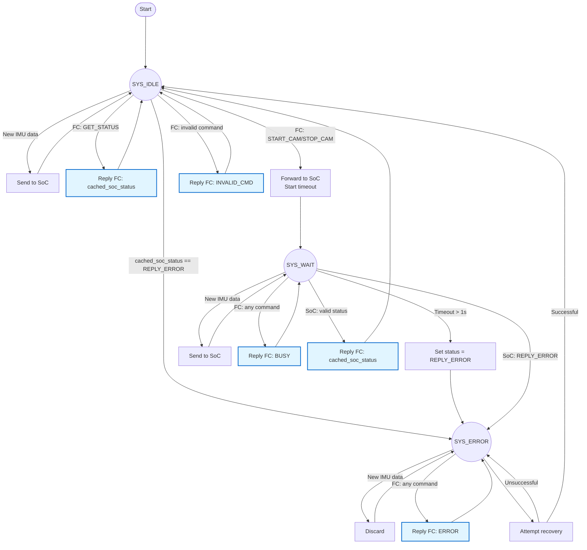

```mermaid
---
config:
    flowchart:
        nodeSpacing: 20
        rankSpacing: 150
---
flowchart TD
    Start([Start]) --> IDLE((SYS_IDLE))

    IDLE --> |cached_soc_status == REPLY_ERROR| ERROR((SYS_ERROR))
    IDLE --> |New IMU data| SendIMU[Send to SoC]
    SendIMU --> IDLE
    IDLE --> |FC: GET_STATUS| ReplyStatus[Reply FC: cached_soc_status]:::fcReply
    ReplyStatus --> IDLE
    IDLE --> |FC: START_CAM/STOP_CAM| ForwardCmd[Forward to SoC<br/>Start timeout]
    ForwardCmd --> WAIT((SYS_WAIT))
    IDLE --> |FC: invalid command| ReplyInvalid[Reply FC: INVALID_CMD]:::fcReply
    ReplyInvalid --> IDLE

    WAIT --> |Timeout > 1s| SetError[Set status = REPLY_ERROR]
    SetError --> ERROR
    WAIT --> |New IMU data| SendIMU2[Send to SoC]
    SendIMU2 --> WAIT
    WAIT --> |FC: any command| ReplyBusy[Reply FC: BUSY]:::fcReply
    ReplyBusy --> WAIT
    WAIT --> |SoC: REPLY_ERROR| ERROR
    WAIT --> |SoC: valid status| ReplyFC[Reply FC: cached_soc_status]:::fcReply
    ReplyFC --> IDLE

    ERROR --> |New IMU data| SendIMU3[Discard] --> ERROR
    ERROR --> |FC: any command| ReplyError[Reply FC: ERROR]:::fcReply
    ReplyError --> ERROR

    ERROR --> REC[Attempt recovery] --> |Unsuccessful| ERROR
    REC --> |Successful| IDLE

    classDef fcReply fill:#e1f5ff,stroke:#0066cc,stroke-width:2px
```
