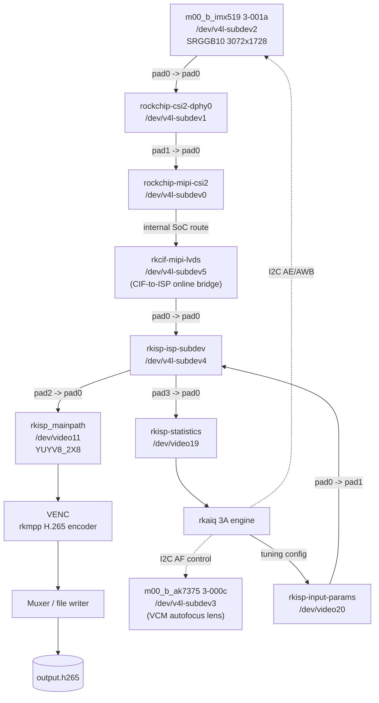

```mermaid
flowchart TD
    SENSOR["m00_b_imx519 3-001a\n/dev/v4l-subdev2\nSRGGB10 3072x1728"]
    DPHY["rockchip-csi2-dphy0\n/dev/v4l-subdev1"]
    CSI2["rockchip-mipi-csi2\n/dev/v4l-subdev0"]
    BRIDGE["rkcif-mipi-lvds\n/dev/v4l-subdev5\n(CIF-to-ISP online bridge)"]
    ISP["rkisp-isp-subdev\n/dev/v4l-subdev4"]
    MAIN["rkisp_mainpath\n/dev/video11\nYUYV8_2X8"]
    VENC["VENC\nrkmpp H.265 encoder"]
    MUXER["Muxer / file writer"]
    OUTFILE[("output.h265")]

    LENS["m00_b_ak7375 3-000c\n/dev/v4l-subdev3\n(VCM autofocus lens)"]
    PARAMS["rkisp-input-params\n/dev/video20"]
    STATS["rkisp-statistics\n/dev/video19"]
    RKAIQ["rkaiq 3A engine"]

    SENSOR -->|"pad0 -> pad0"| DPHY
    DPHY -->|"pad1 -> pad0"| CSI2
    CSI2 -->|"internal SoC route"| BRIDGE
    BRIDGE -->|"pad0 -> pad0"| ISP
    ISP -->|"pad2 -> pad0"| MAIN
    MAIN --> VENC --> MUXER --> OUTFILE

    ISP -->|"pad3 -> pad0"| STATS --> RKAIQ
    RKAIQ -->|tuning config| PARAMS -->|"pad0 -> pad1"| ISP
    RKAIQ -.->|I2C AE/AWB| SENSOR
    RKAIQ -.->|I2C AF control| LENS
```
