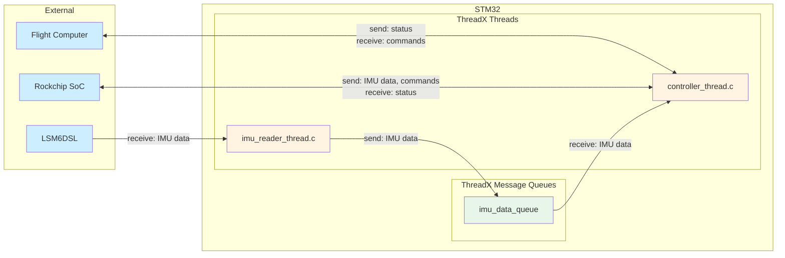

```mermaid
graph LR
    subgraph External
        IMU[LSM6DSL]
        FC[Flight Computer]
        SOC[Rockchip SoC]
    end

    subgraph STM32
        subgraph TXT [ThreadX Threads]
            T_IMU[imu_reader_thread.c]
            T_CTRL[controller_thread.c]
        end

        subgraph TXMQ [ThreadX Message Queues]
            Q_IMU[imu_data_queue]
        end
    end

    IMU --"receive: IMU data"-->T_IMU
    FC <--"send: status <br/> receive: commands"-->T_CTRL
    SOC <--"send: IMU data, commands <br/> receive: status"-->T_CTRL
    
    T_IMU --"send: IMU data"--> Q_IMU
    Q_IMU --"receive: IMU data"--> T_CTRL

    style T_IMU fill:#fff4e1
    style T_CTRL fill:#fff4e1
    style Q_IMU fill:#e8f5e9
    style IMU fill:#cceeff
    style FC fill:#cceeff
    style SOC fill:#cceeff
```
